# 基于向量余弦的文件相似度计算

## 注意

### 环境

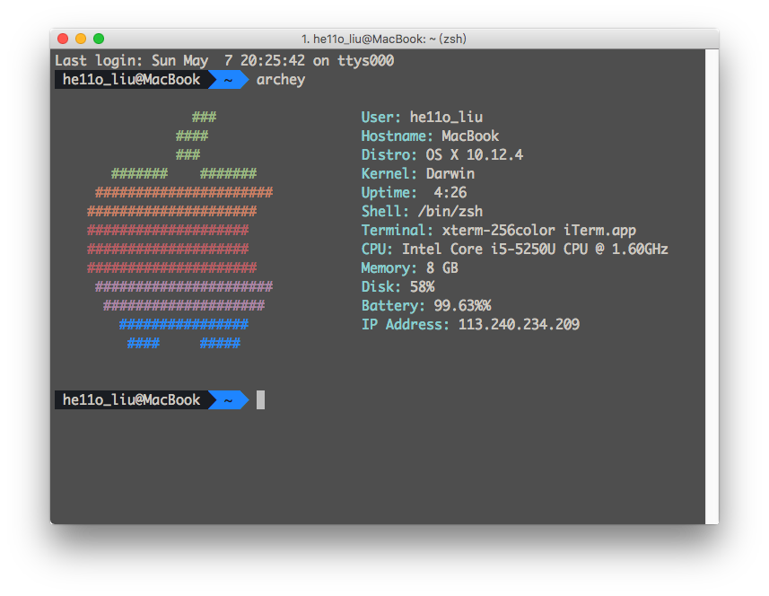

### 注意

- 请在`unix like`系统下运行下面的程序

- 请安装`python`和`python-docx`

- 请先详细阅读`Readme`

- 若程序出错，试着改宏定义。

- 侧写用内存保存，当目录下文件过多，或者文件过大会导致问题。

- 切换`n-grams`和`n-word`请先`make clean`

  ​

## 准备工作

根据参考文献[1]，文本相似度计算的方法主要有两种

- 余弦定律
- Jaccard index

### 余弦定律

从参考资料[3]

- 文本1中出现的字有：$Z_{1}C_{1},Z_{1}C_{2}…Z_{1}C_{n}$
- 在文本中出现的次数有：$Z_{1}n_{1},Z_{1}n_{2}…Z_{1}n_{n}$
- 文本2中出现的字有：$Z_{2}C_{1},Z_{2}C_{2}…Z_{2}C_{m}$
- 在文本中出现的次数有：$Z_{2}n_{1},Z_{2}n_{2}…Z_{2}n_{m}$

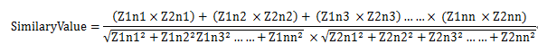

从参考资料[4]

- 先确定`k`和`d`的值
- 对于所有的`K`元语法计算`Hash`并`%d`
- 每个文档的最终结果是一个`d`维侧写

伪代码如下：

- 侧写函数：

  ```c
  function:Create document profile
  profile(document):
  N = document.length();
  for(i = 0 ; i < N-k ; i++ ){
    	h = hashCode(document.substring(i,i+k));
    	profile[h%d]+=1
  }
  ```

- 相似度函数

  ```c
  function:Similarity between document1 and document2
  similarity(document1,document2)
  profile_doc1 = profile(document1);
  profile_doc2 = profile(document2);
  for(i = 0; i < d;i++){
    	mul += profile_doc1[i]*profile_doc2[i];
    	sum_A += profile_doc1[i]*profile_doc1[i];
    	sum_B += profile_doc2[i]*profile_doc2[i];
  }
  similarity = mul/(sqrt(sum_A)*sqrt(sum_B))
  ```

  ​

### Jaccard index

> The **Jaccard index**, also known as **Intersection over Union** and the **Jaccard similarity coefficient** (originally coined *coefficient de communauté* by [Paul Jaccard](https://en.wikipedia.org/wiki/Paul_Jaccard)), is a [statistic](https://en.wikipedia.org/wiki/Statistic) used for comparing the [similarity](https://en.wikipedia.org/wiki/Similarity_measure) and [diversity](https://en.wikipedia.org/wiki/Diversity_index) of [sample](https://en.wikipedia.org/wiki/Sample_(statistics)) sets. 
>
> From Wikipedia[2]

具体算法如下：

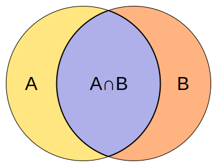

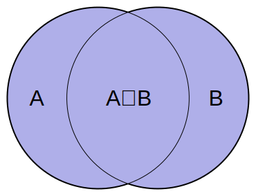


### N-grams N元语法

> An **n-gram model** is a type of probabilistic [language model](https://en.wikipedia.org/wiki/Language_model) for predicting the next item in such a sequence in the form of a (*n* − 1)–order [Markov model](https://en.wikipedia.org/wiki/Markov_chain).[[2\]](https://en.wikipedia.org/wiki/N-gram#cite_note-2) *n*-gram models are now widely used in [probability](https://en.wikipedia.org/wiki/Probability), [communication theory](https://en.wikipedia.org/wiki/Communication_theory), [computational linguistics](https://en.wikipedia.org/wiki/Computational_linguistics) (for instance, statistical [natural language processing](https://en.wikipedia.org/wiki/Natural_language_processing)), [computational biology](https://en.wikipedia.org/wiki/Computational_biology) (for instance, biological [sequence analysis](https://en.wikipedia.org/wiki/Sequence_analysis)), and [data compression](https://en.wikipedia.org/wiki/Data_compression). Two benefits of *n*-gram models (and algorithms that use them) are simplicity and scalability – with larger *n*, a model can store more context with a well-understood [space–time tradeoff](https://en.wikipedia.org/wiki/Space%E2%80%93time_tradeoff), enabling small experiments to scale up efficiently.

简而言之，对于计算机语言学，有以下两种情况：

| 单位   | 示例字符串                  | 一元语法                                     | 二元语法                                     | 三元语法                                     |
| ---- | ---------------------- | ---------------------------------------- | ---------------------------------------- | ---------------------------------------- |
| 字符   | …to_be_or_not_to_be…   | …, t, o, _, b, e, _, o, r, _, n, o, t, _, t, o, _, b, e, … | …, to, o_, _b, be, e_, _o, or, r_, _n, no, ot, t_, _t, to, o_, _b, be, … | …, to_, o_b, _be, be_, e_o, _or, or_, r_n, _no, not, ot_, t_t, _to, to_, o_b, _be, … |
| 单词   | … to be or not to be … | …, to, be, or, not, to, be, …            | …, to be, be or, or not, not to, to be, … | …, to be or, be or not, or not to, not to be, … |


# 初始版本

### C语言实现

将上述伪代码利用C语言实现

- 文件侧写函数实现：

  ```c
  void get_doc_profile(FILE *fp,unsigned long *profile){
      int i = 0;
      char cur_gram[k+1];
      unsigned long read_count = 0;
      unsigned long hash = 0;
      for(i = 0;i < d;i++) profile[i] = 0;
      read_count = fread(cur_gram,sizeof(char),k,fp);
      while(read_count != 0){
          cur_gram[read_count] = 0;
          hash = naive_hash(cur_gram, read_count);
          profile[hash%d] += 1;
  #ifdef DEBUG
          printf("%s %lu\n",cur_gram,hash%d);
  #endif
          read_count = fread(cur_gram,sizeof(char),k,fp);
      }
  }
  ```

- 文件相似度函数实现：

  ```c
  double get_sim_by_profile(unsigned long *profile1,unsigned long *profile2){
      int i = 0;
      double mul = 0,sum_A = 0,sum_B = 0;
      double similarity = 0;
      for(i = 0; i < d;i++){
          mul += profile1[i]*profile2[i];
          sum_A += profile1[i]*profile1[i];
          sum_B += profile2[i]*profile2[i];
      }
      if(sum_A == 0 || sum_B == 0)
          similarity = 0;
      else
          similarity = mul/(sqrt(sum_A)*sqrt(sum_B));
      return similarity;
  }
  ```

- 最简易`Hash`算法 `JAVA 1.5 String`

  ```c
  unsigned long naive_hash(char *str,unsigned long  str_len){
      int hash = 0,i = 0;
      for(i = 0; i < str_len;i++)
          hash = str[i] + 31*hash;
      return hash;
  }
  ```

- 设置参数

  ```c
  #define k 4        //k-Grams
  #define d 65536    //d-Dimensions
  ```

### 初始版本测试

#### 测试输入

- Doc1 文件内容

  ```
  This is DOC1. Similarity Test:
  It was the age of wisdom
  It was the age of foolishness
  ```

- Doc2 文件内容

  ```
  This is DOC2. Similarity Test:
  It was the best of times
  It was the worst of times
  ```

#### 测试输出

```
This 49854
 is  9238
DOC1 6681
. Si 27560
mila 9233
rity 27388
 Tes 54242
...  输出太多这里略去
Finish 1
This 49854
 is  9238
DOC2 6682
. Si 27560
...  输出太多这里略去
Finish 2
Similarity between Doc1 and Doc2 is 0.505650
```


### 初始版本总结

这个初始`naive`版本在写代码和测试过程中很容易发现有以下问题：

- `k`的值选取很重要，若是选择小了，则会重复率很高，选择大了很难碰撞。

  这里的`k-grams`其实是一个最`naive`的相似块的划分。可以想到从简单到难有以下方法：

  - 可以将这个粒度改为一个单词或者两个单词

    针对英文，可以用空格作为区分。而对于中文可能要引入词库。

  - 更高级的语意块的划分。将相同的语意块映射相同的hash值。

- `d`的值就是一个空间和精确度的空间的均衡。当`d`的值选取较大，则会很占内存，但是精确度会得到保证，减少碰撞出现的可能。

- `Hash`函数同样要遵循的原则有：

  - 减少碰撞出现的可能，不同字符串最好映射到不同的hash值
  - 计算复杂度最好小，文本比较输入规模可能比较大。

- **该版本最大问题，见第二版引入。很容易可以避开此查重。**


## 对当前目录下文件进行操作

**注意：这里使用的是`unix_like`的系统，`win`下可能需要更改实现方法**

测试读取当前目录程序

```c
#include <sys/types.h>
#include <dirent.h>
#include <unistd.h>
#include <stdio.h>
#include <stdlib.h>
#include <sys/stat.h>   
#include <unistd.h>

int main(){
    DIR *dir;
    struct dirent *ptr;
    dir = opendir("./");
    if(dir == NULL) {printf("Cannot open path!\n"); exit(0);}
    while((ptr = readdir(dir)) != NULL){
        if(ptr->d_type==DT_REG && ptr->d_name[0] != '.'){
            printf("d_name: %s\n", ptr->d_name);
            printf("d_type: %d\n", ptr->d_type);
        }
    }
    closedir(dir);
    return 0;
}
```

将当前目录下符合标准的文件读入并画出侧写保存在`profile`二维数组中。

由于数组过大，导致目录下最多只能有`20`个文件。

**当然可以利用将`profile`保存到本地文件来解决这个问题。**

输出为文件比较矩阵，当相似度超过0.3时，用红色字体表示。

```c
	if(argc == 2){
        printf("Open path: %s\n",argv[1]);
        dir = opendir(argv[1]);
        if(dir == NULL) {printf("Cannot open path!\n"); exit(0);}
        while((ptr = readdir(dir)) != NULL){
            //check DT_REG and not start with '.'
            if(ptr->d_type==DT_REG && ptr->d_name[0] != '.'){
                printf("Read file %s.....", ptr->d_name);
                fp1 = fopen(ptr->d_name,"r");
                


                if(fp1 == NULL) {printf("Cannot open %s\n",ptr->d_name);continue;}
                strcpy(filename[file_count],ptr->d_name);
                get_doc_profile(fp1, profile[file_count]);
                
                printf("Generate profile success!\n");
                if(file_count == Max_file){printf("Too many file in this path! Max = 100\n"); exit(0);}
                fclose(fp1);
#ifdef debug
                strcpy(tmpname,"./debug/");
                strcpy(tmpname,ptr->d_name);
                strcat(tmpname,"debug");
                debug = fopen(tmpname,"w");
                for(i = 0; i< d;i++){
                    fprintf(debug,"%d\n",profile[file_count][i]);
                }
                fclose(debug);
#endif
                file_count ++ ;
            }
        }
        closedir(dir);

        //输出文件比较矩阵
        printf("%10s","");
        for(i = 0; i< file_count;i++){
            printf("%10s",filename[i]);
        }
        printf("\n");
        for(i = 0; i< file_count;i++){
            printf("%10s",filename[i]);
            for(j = 0; j<file_count;j++){
                if(result[i][j]>0.3){
                    printf("\033[31m%10lf\033[0m",result[i][j]);
                }
                else{
                    printf("%10lf",result[i][j]);
                }
            }
            printf("\n");
        }
    }
```

测试结果如下：

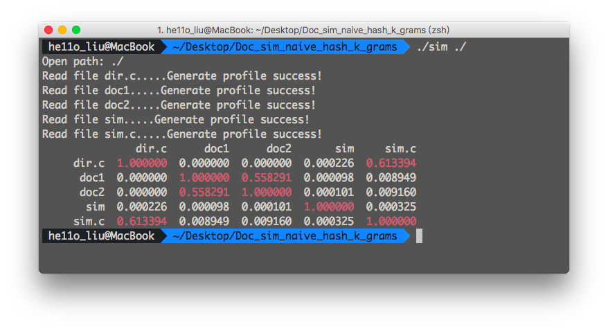


**特别注意：下面内容均使用Python实现 依赖库有`Python-docx` 请利用`pip`安装**

## 读取Microsoft Word格式

由于`C`语言没有现成的读取`Office`库，这里使用`Python`的`python-docx`库来实现。

大致思路如下：

- 利用`docx`库将`doc`文件转为文本文件 后缀为`py_tmp_trans`
- c语言中加入过滤，过滤原有`doc`文档
- 操作完成后删除`py_tmp_trans`

`Python` 脚本如下：

```python
import docx
import os
import sys

def readDocx(docName):
    fullText = []
    doc = docx.Document(docName)
    paras = doc.paragraphs
    for p in paras:
        fullText.append(p.text)
    return '\n'.join(fullText)

#Gen tmp file for filename
def get_python_trans_file(filename,path):
    doc_loc = filename.find(".doc")
    path_loc = filename.find("/")
    new_file = filename[0:doc_loc]
    new_file += ".py_tmp_trans"
    fullText = []
    fullText = readDocx(path+filename)
    file_object = open(path+new_file, 'w')
    file_object.write(fullText)
    file_object.close()
    return new_file

argc = len(sys.argv)
if argc == 2  :
    path = sys.argv[1]
    if path[len(path)-1] != '/':
        path = path + '/'
    if os.path.isdir(path) == False:
        print("%s is not a Path"%(path))
    else:
        files = os.listdir(path)
        #Gen tmp files for doc document
        for i in range(len(files)):
            if files[i].find(".doc") != -1 :
                get_python_trans_file(files[i],path)
        os.system("./sim %s"%(path))
        #Del tmp files
        files = os.listdir(path)
        for i in range(len(files)):
            if files[i].find(".py_tmp_trans") != -1 :
                os.remove(path+files[i])
elif argc == 3  :
    filename1 = sys.argv[1]
    filename2 = sys.argv[2]
    if os.path.exists(filename1) == False or os.path.exists(filename2) == False:
        print("File not exist!")
        sys.exit(1)
    if filename1.find(".doc") != -1 :
        filename1 = get_python_trans_file(filename1,"")
    if filename2.find(".doc") != -1 :
        filename2 = get_python_trans_file(filename2,"")
    print("./sim %s %s"%(filename1,filename2))
    os.system("./sim %s %s"%(filename1,filename2))
    if filename1.find(".py_tmp_trans") != -1 :
        os.remove(filename1)
    if filename2.find(".py_tmp_trans") != -1 :
        os.remove(filename2)
else :
    print("Usage:Python sim.py [file1] [file2] or Python sim.py [path]");
```

测试如下：

`doc1.doc`

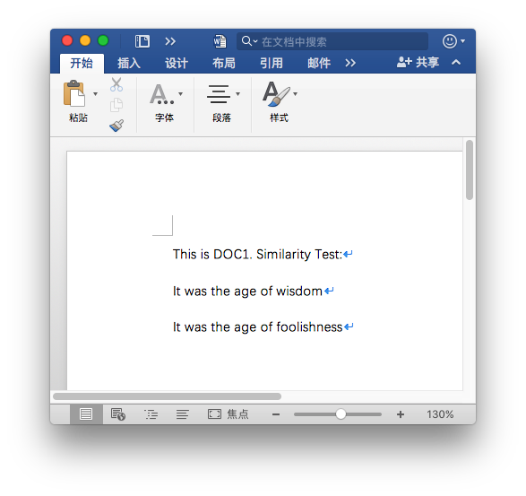

测试:

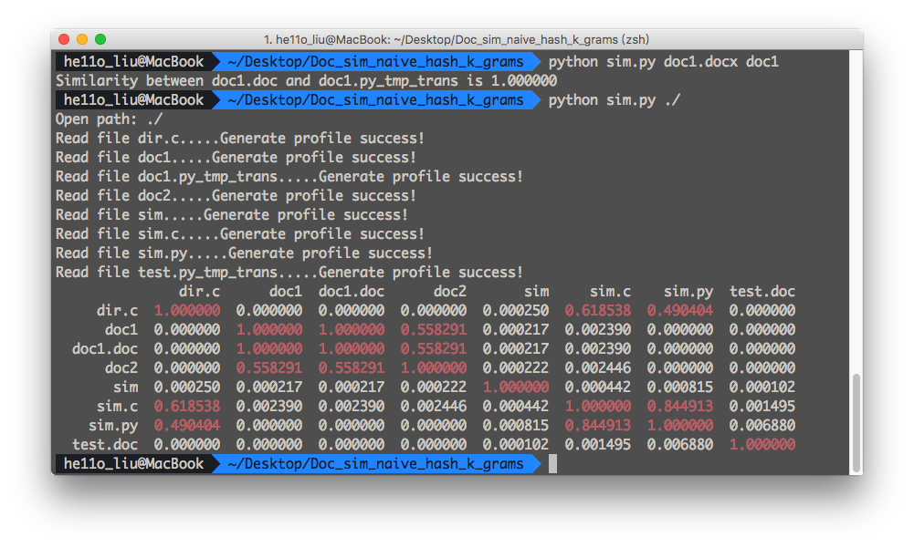


## 针对非中文的分词尝试

针对英文，可以利用空格分词，可以非常容易进行分辨。

```c
void get_doc_profile(FILE *fp,unsigned int *profile){
    int i = 0;
    char word[Max_word];
    char word_set[Max_word*N_word];
    unsigned int hash = 0;
    
    for(i = 0;i < d;i++) profile[i] = 0;
    while(!feof(fp)){
        word_set[0] = '\0';
        for(i = 0; i<N_word;i++){
            fscanf(fp,"%10s",word);
            if(feof(fp)) break;
            strcat(word_set,word);
        }
        hash = naive_hash(word_set);
        profile[hash%d] += 1;
        if(profile[hash%d]>=0xFFFFFFFF) {printf("Overflow");exit(0);}
#ifdef DEBUG
        printf("%s %d\n",word_set,hash%d);
#endif
    }
}
```

其中定义`N_word`为多少个词为一个元组。

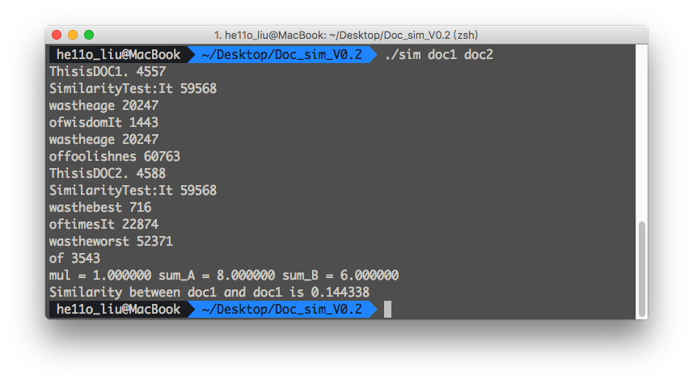

但是这样对于中文文档就非常不友好了

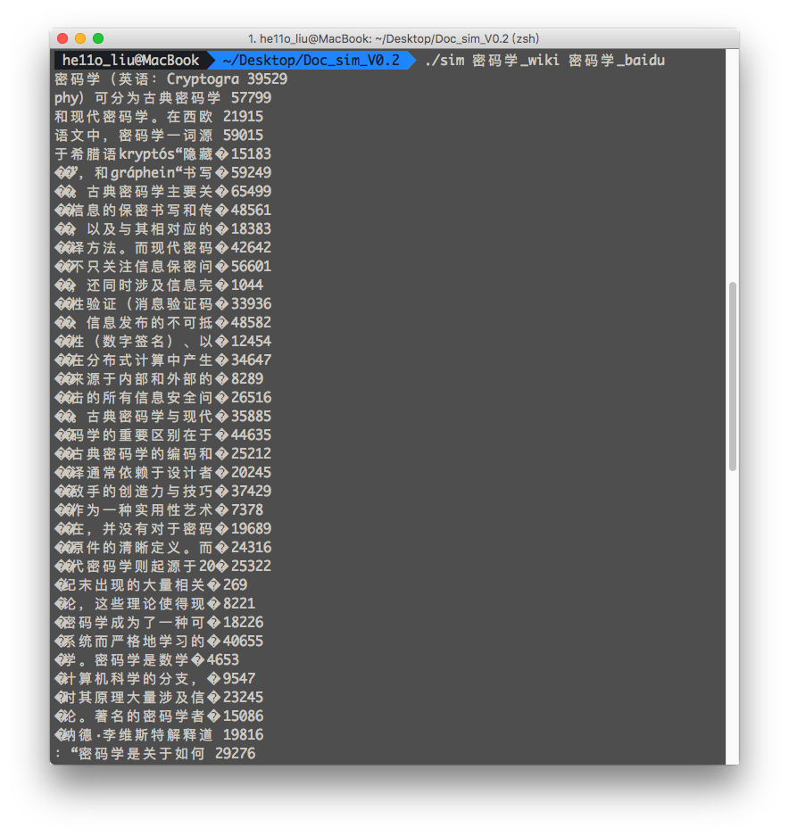

# 第二版本

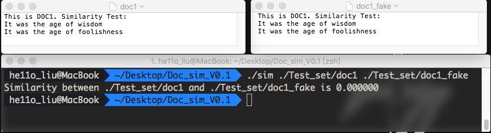

三个空格，就可以骗过第一版本的查重。

对于分词的查重，空格无法骗过，但是添加一个单词就可以了（当`N_word>1`，也就是多个词为一组)。

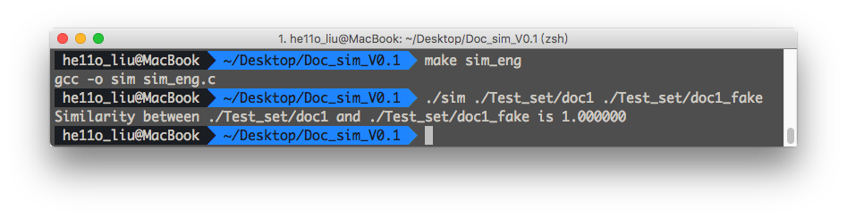

由于划分到不同的元组中，所以即使是相同的元组，由于划分位置不一样，造成了完全不同的错觉。

稍微加以思考，对任意一个文档的`n-gram`，都有n种划分，滑动实现这n种划分的侧写，可以解决这个问题。

测试两个文件的对比修改为如下后：

```c
 if(argc == 3){
        fp1 = fopen(argv[1],"r");
        fp2 = fopen(argv[2],"r");
        if(fp1 == NULL||fp2 == NULL) {printf("Cannot open file!\n");exit(0);}
        for(i = 0; i< k; i++){
            printf("\n\n\n===== %d ======\n",i);
            fseek(fp1, i, SEEK_SET);
            fseek(fp2, i, SEEK_SET);
            printf("Profile1:\n\n\n");
            get_doc_profile(fp1, profile1[i]);
            
            printf("Profile2:\n\n\n");
            get_doc_profile(fp2, profile2[i]);
        }
        
        if(strstr(argv[1],Python_trans)){
            strncpy(filename[0],argv[1],(int)(strstr(argv[1],Python_trans)-argv[1])/sizeof(char));
            strcat(filename[0],"doc");
        }
        else{
            strcpy(filename[0],argv[1]);
        }
        
        if(strstr(argv[2],Python_trans)){
            strncpy(filename[1],argv[2],(int)(strstr(argv[2],Python_trans)-argv[2])/sizeof(char));
            strcat(filename[1],"doc");
        }
        else{
            strcpy(filename[1],argv[2]);
        }
        for(i = 0; i<k;i++){
            for(j = 0; j < k;j++){
                similarity = get_sim_by_profile(profile1[i], profile2[j]);
                if(similarity > max_similarity)
                    max_similarity = similarity;
            }
        }
        printf("Similarity between %s and %s is %lf\n",filename[0],filename[1],max_similarity);
        fclose(fp1);
        fclose(fp2);
    }
```

`fake`若只是第一行加一个空格，这时已经可以正确的查重了。

又遇到了新的问题，对于每一行都给一个空格，会画风到不同的侧写组中。

**这个地方要注意，下面开始是没有数学证明的余弦**

**这里作一个新的尝试，尝试将`n`个侧写累加到一个侧写数组中，这样对余弦有何影响，不是很清楚，但是对于这个多个不同的分组的问题，是可以解决的。**

具体实现是将侧写的清空放在外面，而每次滑动都在侧写上面进行累加。

```c
		//clear profile
        for(i = 0;i < d;i++) profile1[i] = 0;
        for(i = 0;i < d;i++) profile2[i] = 0;
        for(i = 0; i< k; i++){
            fseek(fp1, i, SEEK_SET);
            fseek(fp2, i, SEEK_SET);
            get_doc_profile(fp1, profile1);
            get_doc_profile(fp2, profile2);
        }
```

```
$ ./sim ./Test_set/doc1 ./Test_set/doc1_fake
Similarity between ./Test_set/doc1 and ./Test_set/doc1_fake is 0.874664
$
```

**同样，对于英文的分词的划分方法也做了类似的处理，这里不再描述，两行代码的事**


# 测试集选择与测试比较

测试集文件夹

```
├── baidu_trans		#百度对于wiki密码学中文的中译英
├── baidubaike		#百度百科密码学 中文测试
├── doc1			#测试案例1
├── doc1.docx		#内容同doc1相同，用来测试Microsoft word的读写功能
├── doc1_fake		#测试案例1 每行加空格，用来测试第二版本N-grams对于不同分组的优化
├── doc2			#测试案例2
├── doc2_fake		#内容同doc2类似，每行多加了一个词
├── google_trans	#谷歌对于wiki密码学中文的中译英
├── test.docx		#测试docx读取
└── wikipedia		#wiki密码学 中文测试
```

## 初始版本的两种测试：

注意切换中英文版之前要`make clean`我的规则写的都是生成`sim`的

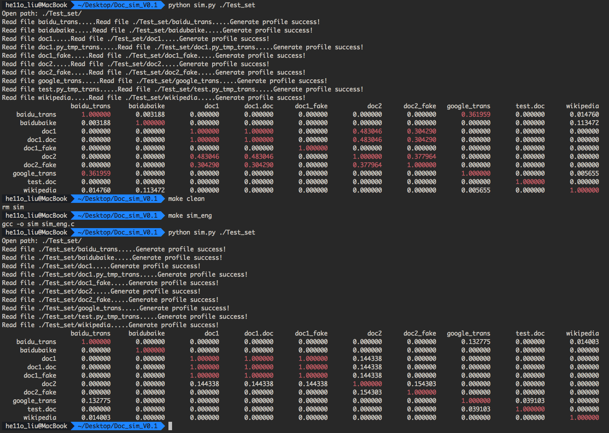

`n-grams`参数

```c
#define k 6         //k-Grams
#define d 65536     //d-Dimensions
```

`n-word`参数

```c
#define Max_word        20
#define N_word          3
```

初始版本由于没有滑动，中间很多数据根本不合理。

- 特别注意其中的`n-gram sim`中`doc1`和`doc1_fake`为0
- `n_word sim`中`doc2`和`doc2_fake`为0

这两个应该是相似度很高的，然而这里相似度很低。

## 改进版本的两个测试

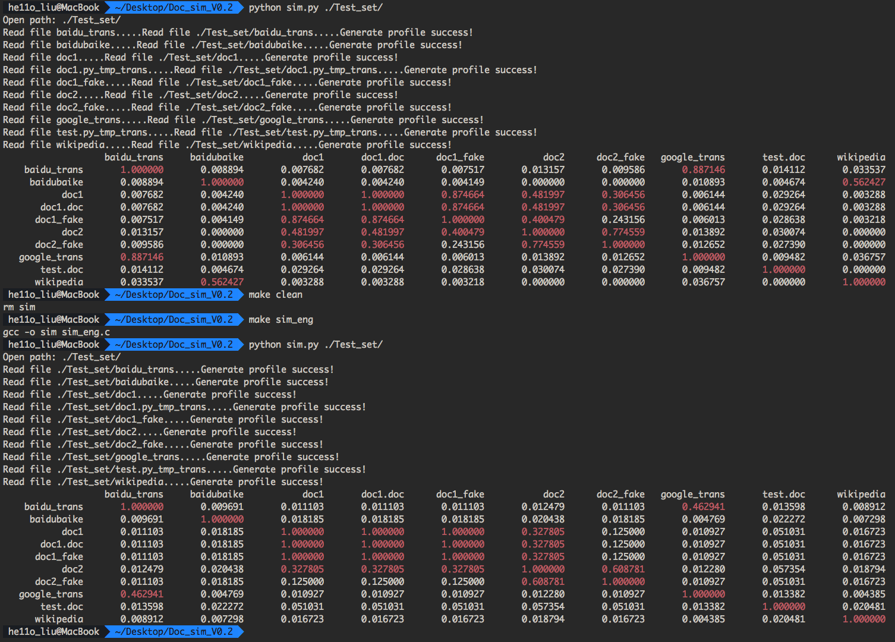

`n-grams`参数

```c
#define k 6         //k-Grams
#define d 65536     //d-Dimensions
```

`n-word`参数

```c
#define Max_word        20
#define N_word          3
```

单独设置`n-word`参数 即词频模式

```
#define N_word          1
```

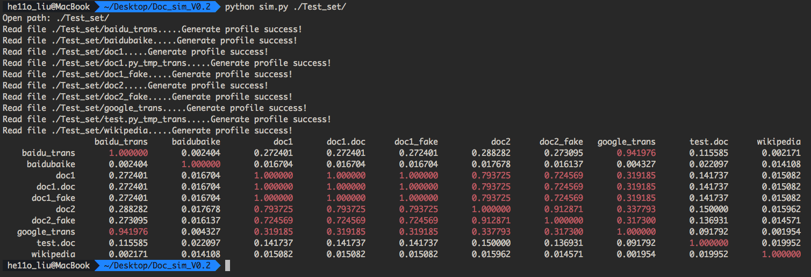

这个版本的数据就漂亮多了，首先注意：

- `n-gram sim`中`doc1`和`doc1_fake`为`0.87` 其中不一样的地方空格算进去了
- `n_word sim`中`doc2`和`doc2_fake`为`0.608`其中是3个词假设形成意群，所以相似度较低。在词频模式中，可以看到这个数据到了`0.91` 说明这两个文档中用的词大致是相同的。
- 有意思的数据是
  - 注意上面的一个表，百度百科和`wiki`中对于密码学的解释相似度为`0.56`，下面很低是因为不支持中文分词，将一大段话对比没有可比性导致的。
  - 注意上面的一个表，百度翻译和谷歌翻译，单看内容有`0.88`的相似度，但是模拟3个词的意群后，这个相似度就到了`0.46`，这说明它们单词大致相同，但是语法不一样的地方非常多。当设置参数为词频模式时，这个相似度到了`0.94`，更说明使用单词是基本一致的。


# 还能做改进但是没有时间做的部分

抛开机器学习，语义分析等进阶的查重方法不说，就当前的查重有以下可以改进的。

- 中文分词，安装第三方库
- 中文英文短语库，短语库映射哈希
- 中文英文放到程序里面判断
- 将侧写保存到文件，支持目录下更多文档
- 利用谷歌的LSH之类，类似的字符串哈希大致相同，当然这个就属于走海明距离那条路的了


## 遇到的问题

- 之前分配给矩阵不是`unsigned int`导致当文件非常大的时候会有溢出的情况。后将矩阵改为`unsigned int`且增加溢出判断后正常。

- 非本路径读取错误

  读取文件名没有带相对路径。

  且要检查相对路径最后是否为`/`

  ```c
  //检查末尾是否为/
  for(i = 0; tmp_filename[i+1]!='\0';i++);
  if(tmp_filename[i]!='/') strcat(tmp_filename,"/");
  ```

  ​

## 参考文献

[1] http://blog.csdn.net/ygrx/article/details/12748857

[2] https://en.wikipedia.org/wiki/Jaccard_index

[3]https://my.oschina.net/BreathL/blog/42477

[4]Princeton Algorithms in JAVA Chapter 14 Hashing
